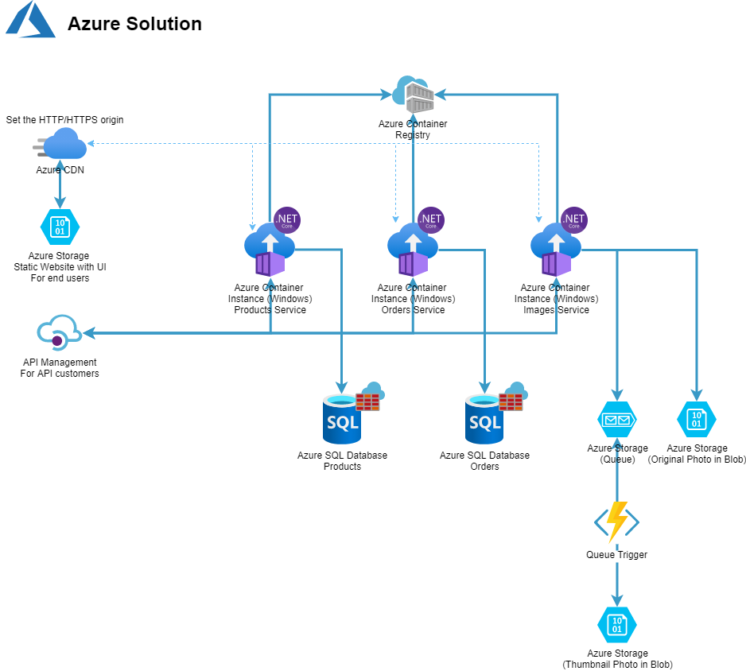

# Sample project

## Introduction
This is a sample project

### Azure Resources
The following Azure resources are used in this project

- Blob Storage
- Queue Storage
- Azure Function App
- Cosmos DB

### Project's cloud solution architecture

### Project's application architecture
- Microservices project
- Domain-Drive Development (DDD)
- Database per Service Design Pattern : as the project is developed DDD, each service can have a database for itself. It's important that based on the service requirements change, the database can be changed flexible.
- Circuit Breaker Design Pattern (via Microsoft.Extensions.Http.Polly) 

### Project' application technologies
- EntiryFrameworkCore
- Azure Storage Model
- Swaschbuckle.AspNetCore -> enhance the API project with Swagger API Documenation & Swagger UI
- Microsoft.Extensions.Http.Polly -> for realising Break Circuit Design Pattern to have resilient Microservices
- Microsoft.Azure.Cosmos.Table

## Create new project via commandline
dotnet new webapi --name Sample.Api.Products

