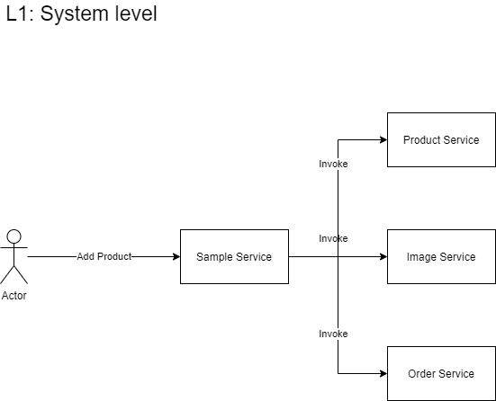

- [Sample project](#sample-project)
  - [Introduction](#introduction)
  - [Azure Resources](#azure-resources)
  - [Project's cloud solution architecture](#projects-cloud-solution-architecture)
  - [Project's application architecture](#projects-application-architecture)
  - [Project' application technologies](#project-application-technologies)

# Sample project

## Introduction
This sample project is a quick start for developing a cloud based solution. The following diagram is Level 1 of the [C4 Model](https://c4model.com/) notation, which describes the `systems level communication` in a solution.

**Scenario**: Assume we have a very simple online product stock with the following features:
- Product Service 
  - Add new product
  - Delete a product
  - Update a product
  - List the products
- Order Service
  - Add a new order
  - List the items of a specific order
- Image Service
  - Upload images to the blob storage
  - Add a message to the storage queue
- Sample Service
  - The centrat service for invoking the services  

**Product and Image services communication**
As soon as a product is added to the online stock a message is sent to a storage queue and a function will be triggered because of the pushed message to the queue. This function generate a thumbnail form the original image. 

## Azure Resources
The following Azure resources are used in this sample project.

- Azure blob Storage
- Azure queue Storage
- Azure Function App
- Azure container registry
- Azure container instance
- Azure database

## Project's cloud solution architecture
Solution Architecture is a follows:

## Project's application architecture
- Microservices project
- Asynchronous Request-Reply
- Database per service
- Circuit Breaker
- Domain-Drive Development (DDD)
- Database per Service Design Pattern : as the project is developed DDD, each service can have a database for itself. It's important that based on the service requirements change, the database can be changed flexible.
- Circuit Breaker Design Pattern (via Microsoft.Extensions.Http.Polly) 

## Project' application technologies
- EntiryFrameworkCore
- Azure Storage Model
- Swaschbuckle.AspNetCore -> enhance the API project with Swagger API Documenation & Swagger UI
- Microsoft.Extensions.Http.Polly -> for Circuit Breaker Design Pattern for more resiliency
- Microsoft.Azure.Cosmos.Table

